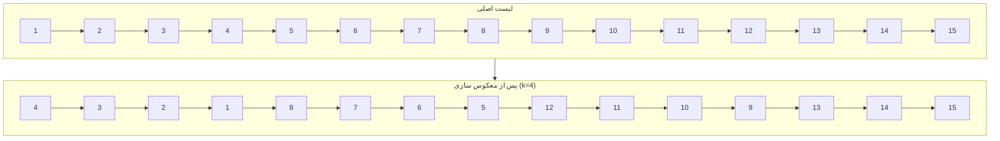

# 9. گره های لیست

## خواسته سوال

معکوس‌سازی گره‌های linked list در گروه‌های k تایی با تغییر اشاره گرها و نه تغییر مقادیر داده ها

**ورودی‌:**

یک $linked list$ از اعداد صحیح (مقادیر با فاصله جدا شده)

عدد $k$ (اندازه گروه)

**خروجی:**

یک $linked list$ با گره‌های معکوس‌شده در گروه‌های k تایی

## راه‌حل

ابتدا یک گره کمکی به نام `dummy` ایجاد می‌کنیم که به ابتدای لیست اشاره دارد. این کار باعث ساده‌تر شدن عملیات روی سر لیست می‌شود.
  
سپس دو اشاره‌گر مهم تعریف می‌کنیم:

  `prev`: انتهای آخرین بخشی که معکوس شده است را نگه می‌دارد

  `kth`: برای پیمایش و بررسی اینکه آیا حداقل $k$ گره جلوتر وجود دارد یا نه

### فرایند معکوس سازی

برای هر گروه `k` تایی:

ابتدا بررسی می‌کنیم که آیا از موقعیت فعلی می‌توان به اندازه‌ی `k` گره جلو رفت یا نه. اگر نتوانیم، کار تمام می‌شود.

اگر ممکن باشد:

  اشاره گر `nxt` را برابر گره بعد از پایان بخش فعلی قرار می دهیم (برای اتصال بخش بعدی پس از معکوس سازی) و اشاره گر `start` را برابر ابتدای بخش فعلی که قرار است معکوس شود.

سپس تابع `reverseSegment` را روی این بخش اجرا می‌کنیم که:
  
اشاره‌گر هر گره را به گره قبلی‌اش تغییر می‌دهد.

تا وقتی به انتهای بخش (`nxt`) نرسیده‌ایم، گره‌ها را به عقب متصل می‌کند.

در پایان، سرِ جدید این بخش را برمی‌گرداند.

بعد از معکوس کردن بخش، `prev.next` را به ابتدای جدید بخش (یعنی سر بخش معکوس‌شده) متصل می‌کنیم و `start.next` را به `nxt` وصل می‌کنیم (چون `start` حالا به انتهای بخش معکوس‌شده تبدیل شده) و نهایتا`prev` را به `start` به‌روزرسانی می‌کنیم و فرآیند برای بخش بعدی تکرار می‌شود.

## پیچیدگی زمان و حافظه

**پیچیدگی زمان**:

$$O(n)$$
  
**پیچیدگی حافظه**:

$$O(n)$$

