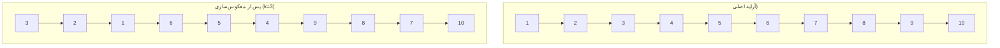

# 9. گره های لیست

## خواسته سوال
معکوس‌سازی گره‌های linked list در گروه‌های k تایی:

- اگر تعداد گره‌ها مضربی از k نباشد، گره‌های باقیمانده بدون تغییر می‌مانند
- فقط مجاز به تغییر اشاره‌گرها هستید (تغییر مقادیر داده‌ها ممنوع است)

**ورودی‌ها:**
- یک linked list از اعداد صحیح (مقادیر با فاصله جدا شده)
- عدد $k$ (اندازه گروه)

**خروجی:**
- یک linked list با گره‌های معکوس‌شده در گروه‌های k تایی

## راه حل
### ۱. پیش‌پردازش و بررسی اولیه
**ایجاد گره tmp**: یک گره موقت در ابتدای لیست برای سهولت مدیریت اشاره گرها ایجاد می شود.

**تنظیم اشاره‌گرهای کمکی**:
  - `prev`: به انتهای بخش معکوس‌شده قبلی اشاره می‌کند
  - `kth`: برای بررسی وجود $k$ گره بعدی استفاده می‌شود

### ۲. معکوس‌سازی هر بخش
**محدوده معکوس‌سازی**: از گره شروع تا قبل از گره پایان

**فرآیند معکوس‌سازی**:
  1. قطع اشاره‌گر گره فعلی به گره بعدی
  2. اتصال گره فعلی به گره قبلی در بخش
  3. حرکت به گره بعدی تا رسیدن به نقطه پایان
  4. بازگشت گره جدید ابتدای بخش معکوس‌شده

### ۳. فرآیند اصلی
1. **بررسی وجود k گره**:
   - از موقعیت فعلی، k گره به جلو حرکت می‌کنیم.
   - اگر قبل از رسیدن به k به انتهای لیست برسیم، فرآیند پایان می‌یابد.
   
2. **ذخیره‌سازی اشاره‌گرهای حیاتی**:
   - گره بعد از بخش k تایی `nxt`
   - گره ابتدای بخش فعلی `start`
   
3. **معکوس‌سازی و اتصال**:
   - اتصال بخش معکوس‌شده به بخش قبلی
   - اتصال انتهای بخش معکوس‌شده به ادامه لیست
   - به‌روزرسانی اشاره‌گر برای بخش بعدی

## پیچیدگی زمانی و حافظه
**پیچیدگی زمانی**: O(n)
  - هر گره دقیقاً یک بار پردازش می‌شود
  - معکوس‌سازی هر بخش kتایی در زمان O(k) انجام می‌شود
  - با توجه به n/k بخش، مجموعاً O(n) عملیات انجام می‌شود
  
**پیچیدگی حافظه**: O(n)
  - فقط از حافظه ثابت برای اشاره‌گرهای کمکی استفاده می‌شود
  - بدون نیاز به ساختار داده اضافی

