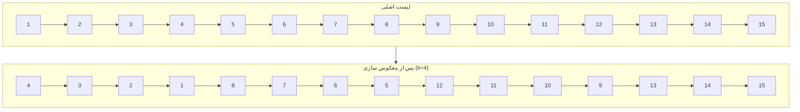

# به نام خدا

## پروژه پژوهشی لیگ علمی پایا

---

1. [گراف جادویی](#2-گراف-جادویی)  
2. [ماتریس حروف](#4-ماتریس-حروف)  
3. [رشته‌های مشابه](#5-رشته‌های-مشابه)  
4. [عملگرها](#6-عملگرها)  
5. [مسیر درخت](#7-مسیر-درخت)  
6. [گراف با دور یا بی دور](#8-گراف-با-دور-یا-بی-دور)
7. [گره های لیست](#9-گره-های-لیست)
8. [درخت ریشه‌دار](#10-درخت-ریشه‌دار)  
9. [نمره تراز](#11-نمره-تراز) 

---

***تهیه کنندگان:***

- سیدمحمد امام جمعه
- ابوالفضل دلوی
- امین رفیعی
- یوسف عربیان
- سیدمحمدهادی نقوی

--- 

**توجه:** لازم به ذکر است که کد مربوط به هر سوال در فایل python ای با شماره همان سوال قرار داده شده است.

---

# 2. گراف جادویی

## خواسته سوال
در این مسأله یک گراف بدون دور (جنگل) با $n$ راس و $m$ یال داریم که هر یال دو مقدار «هزینه» و «ارزش جادویی» دارد. باید زیرمجموعه‌ای از یال ها را طوری انتخاب کنیم که:

مجموع هزینه‌های  یالهای انتخابی از حد $b$ کمتر شود.

زیر‌گراف حاصل از یالهای انتخابی همچنان جنگل (بدون دور) باقی بماند.

مجموع ارزش جادویی یالهای انتخابی حداکثر شود.

**ورودی:**

دو عدد صحیح `n` و `m`

در `m` خط بعدی 4 عدد `v` `u` `cost` و `magic` دریافت می شود که به ترتیب بیانگر دو سر یال و هزینه و ارزش جادویی آن است.

یک عدد صحیح `b` (حداکثر بودجه مجاز)  

**خروجی:**

بیشینه مجموع ارزش جادویی ممکن زیرمجموعه‌ای از یالهای با مجموع هزینه کمتر `b`

## راه حل

### مدل‌سازی به‌صورت مسئله‌ی کوله‌پشتی (Knapsack)
برای مدلسازی سوال، به مسئله کوله پشتی و حل آن با روش برنامه نویسی پویا، 
هر یال را به‌عنوان یک «آیتم» در نظر می‌گیریم:

وزن آیتم = هزینه یال

ارزش آیتم = ارزش جادویی یال

### تعریف آرایه dp

برای حل مسئله از دو آرایه‌ی دوبعدی استفاده می‌کنیم:

آرایه `dp[i][j]` را تعریف می کنیم: بیشینه ارزش جادویی قابل دستیابی با در نظر گرفتن $i$ یال اول و بودجه $j$ 

آرایه `par[i][j]` را تعریف می کنیم: در حالت بهینه با بوجه $j$ و $i$ یال اول، آیا یال $i$ام برداشته می شود یا خیر؟!

### به روزرسانی dp و par

در `dp[i][j]` می توانیم یال $i$ ام را برنداریم و به حالت `dp[i-1][j]` برسیم و اگر یال $i$ ام را برداریم، به حالت `dp[i-1][j-cost[i]]` می رسیم و ارزشمان برابر `dp[i-1][j-cost[i]] + magic[i]` می شود.

اگر حالت دوم بهینه بود، `par[i][j]` برابر $True$ قرار می دهیم و در غیر اینصورت برابر $False$

## بازیابی جواب (Backtracking)
پس از پر شدن جدول:
1. شروع از `i = m` و `j = b`  
2. به‌صورت معکوس تا `i = 1`:
   - اگر `par[i][j] == True`:
     - یال `i` را به پاسخ اضافه می‌کنیم (`ans.append(edges[i])`)
     
     - بودجه‌ی باقی‌مانده را کاهش می‌دهیم: 

       $$j \leftarrow j - cost[i]$$
   - `i` را یک واحد کم می‌کنیم  

در پایان، `ans` شامل لیست یال‌های انتخابی با بیشینه‌ی ارزش جادویی است.

## پیچیدگی زمانی و حافظه

**پیچیدگی زمان:**  

$$O(m \cdot b)$$

  (دو حلقه‌ی تو در تو روی یال‌ها و بودجه)

**پیچیدگی حافظه:**

$$O(m \cdot b)$$
  
برای نگهداری دو آرایه‌ی `dp` و `par`

---

# 4. ماتریس حروف

## خواسته سوال
بررسی امکان ساخت یک کلمه در ماتریس حروف با شرایط زیر:

حرکت فقط به خانه‌های هم‌ضلع (بالا، پایین، چپ، راست)

ممنوعیت استفاده مجدد از هر سلول

شروع از هر سلول دلخواه در ماتریس

**ورودی‌:**

دو عدد صحیح `m` (تعداد سطرها) و `n` (تعداد ستون‌ها)

ماتریس `m × n` حروف (هر سطر با فاصله جدا شده)

کلمه مورد نظر (`word`)

**خروجی:**

اگر کلمه قابل ساخت باشد `True`

اگر قابل ساخت نباشد `False` 

## راه حل

### پیش‌پردازش و بررسی اولیه
**شمارش حروف ماتریس `cnt_brd`:** 
  تعداد تکرار هر حرف در ماتریس در این متغیر ذخیره می شود.

**شمارش حروف کلمه `cnt_word`:** 
  تعداد تکرار هر حرف در کلمه در این متغیر نگهداری می شود.

**بررسی امکان‌پذیری:**
  اگر کلمه حرفی داشته باشد که در ماتریس به تعداد کافی نباشد → خروجی `False`

**بهینه‌سازی جهت جستجو:**
    اگر حرف اول کلمه فراوان‌تر از حرف آخر باشد → کلمه معکوس می‌شود

### جستجوی ژرفانخست (DFS)
تابع `dfs(i, j, k)` به صورت بازگشتی مسیر را بررسی می‌کند:
  
- ذخیره موقت حرف فعلی `tmp`
  
- علامت‌گذاری سلول فعلی `b[i][j] = None`
  
- جستجو در ۴ جهت مجاور (پایین، بالا، راست، چپ)
  
بازگردانی سلول در صورت عدم موفقیت `b[i][j] = tmp`

### فراخوانی اصلی

برای هر سلول منطبق با حرف اول کلمه:

- کپی ماتریس اصلی
  
- فراخوانی `dfs(i, j, 0)`
  
- در صورت موفقیت → `True`

اگر هیچ مسیری یافت نشد → `False`

## پیچیدگی زمان و حافظه

**پیچیدگی زمان:**

$$O(m \cdot n \cdot 4^l)$$
    
**پیچیدگی حافظه:**

$$O(m \cdot n + l)$$

---

# 5. رشته‌های مشابه

## خواسته سوال
دو رشته داریم که با هم مشابه‌اند مگر در یک حرف که یکی از آن‌ها اضافی دارد. حرف اضافی را بیابید.

**ورودی‌:**

دو رشته `s1` و `s2` هر کدام در یک سطر به صورت کارکتر به کارکتر ورودی گرفته می‌شود

  (یکی از دو رشته یک حرف اضافی دارد؛ طول‌ها با هم متفاوت‌اند.)

**خروجی:**

کاراکتر اضافی موجود در رشته‌ی بلندتر  

## راه حل

### بهره‌گیری از خاصیت XOR
یک متغیر `ans` را با مقدار صفر مقداردهی می‌کنیم.  

برای هر حرف در `s1`، مقدار `ans` را با کد ASCII آن حرف XOR می‌کنیم.  

سپس برای هر حرف در `s2` نیز عمل XOR را تکرار می‌کنیم.  

در پایان، مقدار نهایی `ans` برابر کد حرف اضافی است؛ با تبدیل آن به کاراکتر، حرف مورد نظر به دست می‌آید.

## پیچیدگی زمان و حافظه
**پیچیدگی زمان:**

$$O(n)$$

**پیچیدگی حافظه:**

$$O(1)$$

---

# 5. رشته‌های مشابه

## خواسته سوال
دو رشته داریم که با هم مشابه‌اند مگر در یک حرف که یکی از آن‌ها اضافی دارد. حرف اضافی را بیابید.

**ورودی‌:**

دو رشته `s1` و `s2` هر کدام در یک سطر به صورت کارکتر به کارکتر ورودی گرفته می‌شود

  (یکی از دو رشته یک حرف اضافی دارد؛ طول‌ها با هم متفاوت‌اند.)

**خروجی:**

کاراکتر اضافی موجود در رشته‌ی بلندتر  

## راه حل

### بهره‌گیری از خاصیت XOR
یک متغیر `ans` را با مقدار صفر مقداردهی می‌کنیم.  

برای هر حرف در `s1`، مقدار `ans` را با کد ASCII آن حرف XOR می‌کنیم.  

سپس برای هر حرف در `s2` نیز عمل XOR را تکرار می‌کنیم.  

در پایان، مقدار نهایی `ans` برابر کد حرف اضافی است؛ با تبدیل آن به کاراکتر، حرف مورد نظر به دست می‌آید.

## پیچیدگی زمان و حافظه
**پیچیدگی زمان:**

$$O(n)$$

**پیچیدگی حافظه:**

$$O(1)$$

---

# 6. عملگرها

## خواسته سوال

محاسبه خارج قسمت تقسیم دو عدد `a` و `b` بدون استفاده از عملگرهای ضرب و تقسیم و باقیمانده

**ورودی‌:**

دو عدد صحیح `a` و `b`

**خروجی:**

خارج قسمت صحیح تقسیم `a` بر `b` که `b ≠ 0` است.

## راه حل

می‌دانیم:
$$
a = q \times b + r,\quad 0 \le r < b
$$
و هدف یافتن $q$ است. بزرگترین عدد صحیح که:

$$q \times b \le a\$$

حال برای پیدا کردن $q$ نمایش باینری این عدد را یکی یکی از بزرگترین بیت آن می سازیم.

 متغیر $d$ بیتی از عدد $q$ است که میخواهیم ببینیم آیا بزرگترین بیت $q$ است یا نه و $tmp = d \times b$ که تا وقتی $tmp$ از $a$ کوچکتر است $d$ را یک بیت به سمت چپ شیفت می دهیم.
 
  زمانی که $tmp > a$ شد از لوپ خارج می شویم $tmp$ را از $a$ کم می کنیم و بیت $d$ را یه $ans$ اضافه می کنیم در نهایت $ans$ را خروجی می دهیم.

می‌دانیم:  
$$a = q \times b + r,\quad 0 \le r < b$$  
هدف یافتن $q$ است (بزرگ‌ترین عدد صحیح که $q \times b \le a$).

**یافتن بزرگ‌ترین ضریب بیتی**

مادامی که متغیر `tmp` کوچکتر مساوی متغیر `a` است، آن را یک بیت به سمت چپ شیفت می دهیم. (ضربدر 2 می کنیم.)

متغیر `cnt` را هم که ضریب `b` داخل `tmp` را نگه می دارد، هر بار به سمت چپ شیفت می دهیم. (ضربدر 2 می کنیم.)

**کاهش مرحله‌ای**  
   تا زمانی که `tmp ≥ b`:  
   1. اگر `a ≥ tmp`:  
      - `a -= tmp`  
      - `ans += cnt`  
   2. سپس هر بار یک بیت به راست شیفت می‌دهیم:  
        `tmp >>= 1`  
        `cnt >>= 1`

   این کار بیت‌های خارج‌قسمت $q$ را از بزرگ به کوچک تعیین می‌کند.

## پیچیدگی زمان و حافظه

**پیچیدگی زمان:**

$$O(\lg a)$$

**پیچیدگی حافظه**

$$O(1)$$

---

# 7. مسیر درخت

## خواسته سوال

پیدا کردن طولانی ترین مسیر، به ازای هر راس $v$ درون یک درخت ریشه دار و وزن دار، به طوری که مسیر از راس $v$ آغاز شود و مجموع وزن های یال های مسیر مضرب P باشد.

**ورودی‌:**
- یک عدد صحیح `n` (تعداد رئوس درخت)
- یک عدد صحیح `P` (عددی اول)
- `n-1` خط که هرکدام سه عدد `u v w` را مشخص می‌کنند (یال بین `u` و `v` با وزن `w`)

**خروجی:**
- برای هر رأس `v`، بیشینه طول مسیر از `v` که مجموع وزن‌های آن مضربی از `P` باشد.

## راه حل

### تعریف DP پایین‌رو و بالا‌رو

$dpD_{v, i}$:

   بیشترین تعداد یال‌هایی که در مسیری از `v` به پایین طی می‌شود و مجموع وزن یال‌ها در این مسیر باقیمانده `i` بر `P` دارد.  

  این مقدار در اولین DFS (`DFS1`) و در زمان خروج از هر رأس با بررسی زیر‌درخت‌های آن آپدیت می‌شود.  

$dpU_{v, i}$:

  بیشترین تعداد یال‌هایی که در مسیری از `v` به بالا (از طریق پدرش) طی می‌شود و مجموع وزن یال‌ها باقیمانده `i` بر `P` دارد.  

  این مقدار در DFS دوم (`DFS2`) و در زمان ورود به هر رأس و بررسی اثر مسیرهای دیگر فرزندان آپدیت می‌شود.

### الگوریتم DFS

#### DFS اول – پایین‌رو (`DFS1`)
برای هر رأس `v`:

ابتدا DFS را روی همه‌ی فرزندان اجرا می‌کنیم.

سپس به ازای هر فرزند `u` و وزن `w`، برای هر مقدار `i`:
  
  اگر `dpD[u][i]` معتبر باشد، مقدار `dpD[v][(i + w) % P]` را با `dpD[u][i] + 1` آپدیت می‌کنیم.

#### DFS دوم – بالا‌رو (`DFS2`)
برای هر رأس `v`:

به ازای هر مقدار `i` از 0 تا `P-1`، از میان مسیرهای `dpD` بچه‌ها و `dpU` خود `v`، بهترین دو مسیر مستقل (با رئوس متفاوت) را نگه می‌داریم.

سپس به ازای هر فرزند `u`، از میان مسیرهای دیگر (غیر از `u`) مقدار `dpU[u][(i + w) % P]` را تعیین می‌کنیم. اگر مسیر معتبری باشد، یک واحد به آن اضافه می‌شود.

در انتها DFS را روی `u` ادامه می‌دهیم.

### استخراج خروجی
پس از اجرای هر دو DFS، برای هر رأس `v`:

خروجی نهایی `max(dpD[v][0], dpU[v][0])` خواهد بود.

### راه دوم اگر مقدار P زیاد باشد
در این راه به ازای هر راس $v$ الگوریتم DFS را از این راس اجرا میکنیم و مسیر های که شروعشان این راس است را چک میکنیم و اگر مسیری بر P بخش پذیر بود طول این مسیر را در `ans[v]` آپدیت میکنیم

## پیچیدگی زمان و حافظه

**پیچیدگی زمان:**

$$O(P \cdot n)$$

چون در هر DFS، برای هر رأس `v`، روی `P` حالت مختلف باقی‌مانده کار می‌کنیم.  
اگر `P > n` باشد، بهتر است برای هر رأس DFS مجزایی اجرا کنیم و پاسخ را بیابیم، که در این حالت پیچیدگی زمانی تبدیل می‌شود به:

$$O(n^2)$$

**پیچیدگی حافظه:**

$$O(P \cdot n)$$

---

# 8. گراف با دور یا بی دور

## خواسته سوال

یک گراف جهت‌دار با `n` رأس و `m` یال اولیه داریم. سپس `q` کوئری داریم که در هر کوئری یکی از عملیات زیر انجام می‌شود:

- `+ u v` افزودن یال از `u` به `v`
- `- u v` حذف یال از `u` به `v`

پس از هر کوئری بررسی می شود که آیا گراف بدون دور (DAG) است یا نه. اگر هست:

`Yes` چاپ می شود

سپس یک ترتیب توپولوژیک معتبر را در همان خط چاپ می شود.

در غیر این صورت:

فقط `No` چاپ می شود.

## راه حل

برای هر کوئری، ابتدا تغییرات را روی گراف اعمال می‌کنیم. سپس DFS را از تمام رئوس انجام می‌دهیم. در هنگام خروج از هر رأس $v$ آن را به لیست ترتیب توپولوژیک اضافه می‌کنیم.

هم‌زمان، بررسی می‌کنیم که تمام یال‌های برگشتی از $v$ (در گراف معکوس) به رئوسی اشاره نکنند که قبلاً از آن‌ها خارج شده‌ایم. اگر چنین یالی باشد، به معنی وجود یک دور است.

اگر در انتهای DFS هیچ دوری شناسایی نشد، گراف یک DAG است و ترتیب توپولوژیک به‌دست‌آمده معتبر است.

## پیچیدگی زمان و حافظه

**پیچیدگی زمان:**

  $$O(q \cdot (n + m))$$

برای هر کوئری DFS کامل روی گراف انجام می‌شود.

**پیچیدگی حافظه:**

  $$O(n + m)$$

برای نگهداری گراف و وضعیت بازدید از رئوس.

---

# 9. گره های لیست

## خواسته سوال

معکوس‌سازی گره‌های linked list در گروه‌های k تایی با تغییر اشاره گرها و نه تغییر مقادیر داده ها

**ورودی‌:**

یک $linked list$ از اعداد صحیح (مقادیر با فاصله جدا شده)

عدد $k$ (اندازه گروه)

**خروجی:**

یک $linked list$ با گره‌های معکوس‌شده در گروه‌های k تایی

## راه‌حل

ابتدا یک گره کمکی به نام `dummy` ایجاد می‌کنیم که به ابتدای لیست اشاره دارد. این کار باعث ساده‌تر شدن عملیات روی سر لیست می‌شود.
  
سپس دو اشاره‌گر مهم تعریف می‌کنیم:

  `prev`: انتهای آخرین بخشی که معکوس شده است را نگه می‌دارد

  `kth`: برای پیمایش و بررسی اینکه آیا حداقل $k$ گره جلوتر وجود دارد یا نه

### فرایند معکوس سازی

برای هر گروه `k` تایی:

ابتدا بررسی می‌کنیم که آیا از موقعیت فعلی می‌توان به اندازه‌ی `k` گره جلو رفت یا نه. اگر نتوانیم، کار تمام می‌شود.

اگر ممکن باشد:

  اشاره گر `nxt` را برابر گره بعد از پایان بخش فعلی قرار می دهیم (برای اتصال بخش بعدی پس از معکوس سازی) و اشاره گر `start` را برابر ابتدای بخش فعلی که قرار است معکوس شود.

سپس تابع `reverseSegment` را روی این بخش اجرا می‌کنیم که:
  
اشاره‌گر هر گره را به گره قبلی‌اش تغییر می‌دهد.

تا وقتی به انتهای بخش (`nxt`) نرسیده‌ایم، گره‌ها را به عقب متصل می‌کند.

در پایان، سرِ جدید این بخش را برمی‌گرداند.

بعد از معکوس کردن بخش، `prev.next` را به ابتدای جدید بخش (یعنی سر بخش معکوس‌شده) متصل می‌کنیم و `start.next` را به `nxt` وصل می‌کنیم (چون `start` حالا به انتهای بخش معکوس‌شده تبدیل شده) و نهایتا`prev` را به `start` به‌روزرسانی می‌کنیم و فرآیند برای بخش بعدی تکرار می‌شود.

## پیچیدگی زمان و حافظه

**پیچیدگی زمان**:

$$O(n)$$
  
**پیچیدگی حافظه**:

$$O(n)$$

---

# 10. درخت ریشه‌دار

## خواسته سوال

درختی ریشه‌دار با `n` رأس و وزن‌های اولیه روی هر رأس داده شده است. سپس `q` عملیات به صورت `(v, w)` داریم که وزن رأس `v` را به `w` تغییر می‌دهند. بعد از هر به‌روزرسانی، باید مجموع وزن بیشینه‌ی یک مجموعه‌ی مستقل روی کل درخت را گزارش کنیم.

**ورودی‌:**

عدد صحیح `n`

`n-1` یال غیر‌جهت‌دار که درخت را می‌سازند

`n` عدد وزن اولیه‌ی هر رأس

عدد صحیح `q`

`q` خط هر کدام دو عدد `(v, w)`

**خروجی:**

بعد از هر عملیات، بیشینه‌ی وزن مجموعه‌ی مستقل روی درخت  

## راه حل

### تعریف dp

دو آرایه $dp0$ و $dp1$ را برای هر راس $v$ به شکل زیر تعریف می کنیم:

$$dp0[v] = \sum_{u \in \mathrm{children}(v)} \max\bigl(dp0[u],dp1[u]\bigr)$$

$$dp1[v] = val[v] + \sum_{u \in \mathrm{children}(v)} dp0[u]$$

### مقداردهی اولیه

با یک DFS از ریشه (مثلاً رأس $1$):

والد و فرزندان هر رأس را تعیین می‌کنیم.

در حالت پس‌گرد (post-order)، مقادیر `dp0` و `dp1` را محاسبه می‌کنیم.

### به‌روزرسانی وزن و پاسخ‌گویی

پس از هر بار که `val[v]` تغییر کرد:
از رأس `v` تا ریشه بالا می‌رویم.  

برای هر رأس $x$ در مسیر، مجدداً مقادیر dp ها را آپدیت می کنیم.

$$dp1[x] = val[x] + \sum_{u \in \mathrm{children}(x)} dp0[u]$$

$$dp0[x] = \sum_{u \in \mathrm{children}(x)} \max(dp0[u],dp1[u])$$

در پایان پاسخ مسئله اینگونه به دست می آید.

$$\max\bigl(dp0[1],dp1[1]\bigr)$$

## پیچیدگی زمان و حافظه

**پیچیدگی زمان:**

$$O(n + q \cdot n)$$

**پیچیدگی حافظه:**

$$O(n)$$

---

# 11. نمره تراز

این سوال نیاز به توضیح خاصی ندارد چراکه تمام وردوی ها گرفته شده و طبق توضیحات خود سوال محاسبات انجام شده است.
ابتدا میانگین برای هر درس حساب شده است و سپس انحراف معیار در هر درس
و سپس تراز هر شخص در هر درس
و در نهایت تراز کلی با توجه به ضریب دروس برای هر فرد محاسبه شده است
در اخر هم برای زیبایی با استفاده از کتابخانه matplotlib تراز هر فرد به صورت نموداری نمایش داده می‌شود
