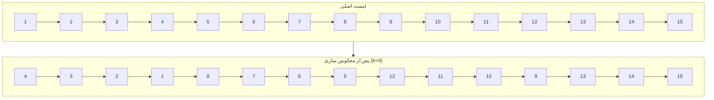

# الگوریتم کوله‌پشتی

در این سوال، نسخه‌ای از الگوریتم کوله‌پشتی را بررسی می‌کنیم چرا که گراف در ابتدا جنگل است و با کم کردن یالها رد اخر نیز جنگل می‌ماند پس محدودیتی گراف در سوال ایجاد نمی‌کند

---

## ایده اصلی

در الگوریتم کوله‌پشتی ۰/۱ کلاسیک، ما برای هر آیتم و هر بودجه ممکن، مقدار بهینه را نگهداری می‌کنیم. اما واقعیت این است که برای محاسبه `dp[i][j]` تنها به `dp[i-1][j - cost[i]]` نیاز داریم.

---

## چرا از عقب به جلو پیمایش می‌کنیم؟

اگر به صورت افزایشی از 0 به B برویم، ممکن است مقادیر `dp[j]` که در همین iteration به‌روز شده‌اند، دوباره برای `dp[j + cost[i]]` استفاده شوند. این باعث می‌شود که یال بیش از یک‌بار انتخاب شود، که خلاف منطق کوله‌پشتی ۰/۱ است. برای جلوگیری از این مشکل، باید از `B` به `cost[i]` به عقب برویم.

---

## پیچیدگی زمانی و فضایی

- **زمان**:  O(n*B)
- **فضا**: O(B)

---

## نتیجه‌گیری

با استفاده از برنامه‌نویسی پویا این سوال را حل کردیم

---

# ماتریس حروف (سوال 4)

## خواسته سوال
بررسی امکان ساخت یک کلمه در ماتریس حروف با شرایط زیر:
- حرکت فقط به خانه‌های هم‌ضلع (بالا، پایین، چپ، راست)
- ممنوعیت استفاده مجدد از هر سلول
- شروع از هر سلول دلخواه در ماتریس

**ورودی‌ها:**
- دو عدد صحیح `m` (تعداد سطرها) و `n` (تعداد ستون‌ها)
- ماتریس `m × n` حروف (هر سطر با فاصله جدا شده)
- کلمه مورد نظر (`word`)

**خروجی:**
- اگر کلمه قابل ساخت باشد `True`
- اگر قابل ساخت نباشد `False` 

## راه حل

### ۱. پیش‌پردازش و بررسی اولیه
**شمارش حروف ماتریس `cnt_brd`:** 
  تعداد تکرار هر حرف در ماتریس محاسبه می‌شود

مس
**شمارش حروف کلمه `cnt_word`:** 
  تعداد تکرار هر حرف در کلمه محاسبه می‌شود

**بررسی امکان‌پذیری:**
  اگر کلمه حرفی داشته باشد که در ماتریس به تعداد کافی نباشد → خروجی `False`

**بهینه‌سازی جهت جستجو:**
    اگر حرف اول کلمه فراوان‌تر از حرف آخر باشد → کلمه معکوس می‌شود

### ۲. جستجوی ژرفانخست (DFS)
تابع `dfs(i, j, k)` به صورت بازگشتی مسیر را بررسی می‌کند:
- **پارامترها:**
  - `i`, `j`: مختصات فعلی در ماتریس
  - `k`: اندیس حرف فعلی در کلمه
- **شرط توقف موفق:**
  - `k == len(word)` (تمام حروف طی شده) → `True`
- **شرط توقف ناموفق:**
  - خارج از محدوده ماتریس
  - حرف سلول با `word[k]` مغایرت دارد
  - سلول قبلاً استفاده شده
- **مراحل اصلی:**
  1. ذخیره موقت حرف فعلی `tmp`
  2. علامت‌گذاری سلول فعلی `b[i][j] = None`
  3. جستجو در ۴ جهت مجاور (پایین، بالا، راست، چپ)
  4. بازگردانی سلول در صورت عدم موفقیت `b[i][j] = tmp`

### ۳. فراخوانی اصلی
- برای هر سلول منطبق با حرف اول کلمه:
  - کپی ماتریس اصلی
  - فراخوانی `dfs(i, j, 0)`
  - در صورت موفقیت → `True`
- اگر هیچ مسیری یافت نشد → `False`

## پیچیدگی زمانی و حافظه
- **پیچیدگی زمانی:**
    `O(m × n × 4^l)`
- **پیچیدگی حافظه:**
    `O(m × n + l)`

---

# جمع‌بندی نهایی – یافتن حرف اضافی بین دو رشته

## صورت مسئله:
دو رشته داریم (`s1` و `s2`) که یکی فقط **یک حرف بیشتر** از دیگری دارد (ترتیب حروف ممکن است متفاوت باشد).  
می‌خواهیم آن **حرف اضافی** را پیدا کنیم.

---

## راه‌حل پیشنهادی: استفاده از XOR

##  تحلیل زمان (Time Complexity):

| مرحله        | تعداد عملیات       | زمان |
|--------------|---------------------|------|
| پیمایش s1     | `len(s1)`           | O(n) |
| پیمایش s2     | `len(s2)` = `n+1`   | O(n) |
| مجموع        | خطی در اندازه ورودی | ✅ **O(n)** |

> زمان اجرای الگوریتم **خطی** است.

---

## تحلیل حافظه (Space Complexity):

- استفاده از فقط یک متغیر `result` (int)
- هیچ لیست، آرایه یا ساختار اضافی نداریم
- حافظه‌ی رشته‌ها جزو ورودی محسوب می‌شود و در تحلیل لحاظ نمی‌گردد

> حافظه‌ی مصرفی مستقل از اندازه ورودی است.  
>  **Space Complexity = O(1)**

---

## مزایای این روش:

- بسیار سریع و سبک
- فقط با یک متغیر کار می‌کند
- ترتیب حروف مهم نیست
- مناسب برای ورودی‌های بسیار بزرگ

---

## نتیجه‌گیری:

> با استفاده از خاصیت ریاضی XOR، توانستیم مسئله را با  
> **زمان خطی (`O(n)`)** و **حافظه ثابت (`O(1)`)** حل کنیم.  
> این روش از نظر عملکرد و سادگی، کاملاً بهینه است.

---

## تقسیم a بر b بدون عملگر های ضرب و تقسیم و باقیمانده
میدانیم که میتوان نوشت $a = q \times b + r$ که $0 \leq r < b$ و چون هدف ما پیدا کردن خارج قسمت است باید $q$ را پیدا کنیم. $q$ بزرگترین عدد صحیح است به طوری که 
$q \times b \leq a$
برای پیدا کردن $q$ نمایش باینری این عدد را یکی یکی از بزرگترین بیت آن میسازیم. متغیر $d$ بیتی از عدد $q$ است که میخواهیم ببینیم آیا بزرگترین بیت $q$ است یا نه و $tmp = d \times b$ که تا وقتی $tmp$ از $a$ کوچکتر است $d$ را یک بیت به سمت چپ شیفت میدهیم و زمانی که $tmp > a$ شد از لوپ خارج میشویم $tmp$ را از $a$ کم میکنیم و بیت $d$ را یه $ans$ اضافه میکنیم در نهایت $ans$ را خروجی میدهیم.

### پیچیدگی زمانی
چون هر مرتبه یکی از بیت های $q$ را قرار میدهیم و خود $q$ از $O(a)$ است و برای هر بیت روی همه ی بیت ها حرکت میکنیم این کد از $O(log^2{a})$ است

---

## پیدا کردن بلندترین مسیر بخش پذیر به P
ابتدا درخت را از راس 1 ریشه دار میکنیم برای این مسئله از dynamic programming استفاده می کنیم $dpD_{v, i}$ برابر است با بلندترین مسیری که از $v$ شروع شود در زیر درخت $v$ به سمت پایین حرکت کند و باقی مانده جمع وزن یال های این مسیر بر $P$، $i$ باشد که برای آپدیتش در DFS پس از اجرای الگوریتم روی بچه های $v$ و هنگام خروج روی همه ی بچه های $v$ فور می زنیم و مقدار $dpD_{v, i}$ را آپدیت می کنیم. $dpU_{v, i}$ را تعریف میکنیم طولانی ترین مسیری که از $v$ شروع شود از یال $v$ به پدرش $p$ استفاده کند و باقی مانده جمع وزن یال هایش بر $P$، $i$ باشد. برای آپدیتش در الگوریتم DFS وقتی که وارد یک راس مانند $v$ می شویم این دیپی را برای بچه هایش آپدیت میکنیم که به ازای هر $i$ وقتی که از یکی از بچه های $v$ مثل $u$ وارد $v$ میشویم یا همانجا میمانیم یا از یال $v$ به پدرش استفاده میکنیم که میشود $dpU_{v, i}$ و یا به بچه های دیگر $v$ میرویم که میشود $dpD_{u,i}$ و اینگونه $dpU_{u,i}$ را به ازای همه ی بچه های $v$ آپدیت می کنیم.
### پیچیدگی زمانی
چون از الگوریتم DFS استفاده می کنیم و در هر کدام به ازای همه ی $i$ ها از 1 تا $P$ فور میزنیم این کد از $O(P(n + m))$ است ولی چون گراف درخت است و $m = n - 1$ پس اوردر این کد میشود $O(Pn)$
اگر $P > n$ برای بهبود این کد میتوان از هر راس DFS زد و بلندترین مسیر بخش بذیر به $P$ را پیدا کرد اینگونه پیچیدگی زمان کد میشود $O(n^2)$ 

---

## چک کردن DAG بود گراف در کوئری ها
برای این سوال در هر کوئری پس از اعمل تغییرات روی گراف یک بار الگوریتم DFS را روی گراف جهتدار اجرا می کنیم و هنگامی که از راسی مانند $v$ خارج میشویم این راس را به توپولوژیک سورت اضافه میکنیم که اگر گراف DAG باشد همه ی راس هایی که $v$ به آنها یال دارد قبل از خروج از $v$ آنها را به توپولوژیکال سورت اضافه کردیم و در لیست قبل از $v$ قرار دارند پس در همان DFS این که همه راس هایی که $v$ به آنها یال دارد در لیست آمده اند را چک میکنیم که اگر درست بود در جواب کوئری توپولوژیکال سورت را خروجی میدهیم

### پیچیدگی زمانی
چون برای هر کوئری یکبار الگوریتم DFS را اجرا میکنیم این کد از $O(q(n + m))$ است

---

# 9. گره های لیست

## خواسته سوال
معکوس‌سازی گره‌های linked list در گروه‌های k تایی:

- اگر تعداد گره‌ها مضربی از k نباشد، گره‌های باقیمانده بدون تغییر می‌مانند
- فقط مجاز به تغییر اشاره‌گرها هستید (تغییر مقادیر داده‌ها ممنوع است)

**ورودی‌ها:**
- یک linked list از اعداد صحیح (مقادیر با فاصله جدا شده)
- عدد $k$ (اندازه گروه)

**خروجی:**
- یک linked list با گره‌های معکوس‌شده در گروه‌های k تایی

## راه حل
### ۱. پیش‌پردازش و بررسی اولیه
**ایجاد گره tmp**: یک گره موقت در ابتدای لیست برای سهولت مدیریت اشاره گرها ایجاد می شود.

**تنظیم اشاره‌گرهای کمکی**:
  - `prev`: به انتهای بخش معکوس‌شده قبلی اشاره می‌کند
  - `kth`: برای بررسی وجود $k$ گره بعدی استفاده می‌شود

### ۲. معکوس‌سازی هر بخش
**محدوده معکوس‌سازی**: از گره شروع تا قبل از گره پایان

**فرآیند معکوس‌سازی**:
  1. قطع اشاره‌گر گره فعلی به گره بعدی
  2. اتصال گره فعلی به گره قبلی در بخش
  3. حرکت به گره بعدی تا رسیدن به نقطه پایان
  4. بازگشت گره جدید ابتدای بخش معکوس‌شده

### ۳. فرآیند اصلی
1. **بررسی وجود k گره**:
   - از موقعیت فعلی، k گره به جلو حرکت می‌کنیم.
   - اگر قبل از رسیدن به k به انتهای لیست برسیم، فرآیند پایان می‌یابد.
   
2. **ذخیره‌سازی اشاره‌گرهای حیاتی**:
   - گره بعد از بخش k تایی `nxt`
   - گره ابتدای بخش فعلی `start`
   
3. **معکوس‌سازی و اتصال**:
   - اتصال بخش معکوس‌شده به بخش قبلی
   - اتصال انتهای بخش معکوس‌شده به ادامه لیست
   - به‌روزرسانی اشاره‌گر برای بخش بعدی

## پیچیدگی زمانی و حافظه
**پیچیدگی زمانی**: O(n)
  - هر گره دقیقاً یک بار پردازش می‌شود
  - معکوس‌سازی هر بخش kتایی در زمان O(k) انجام می‌شود
  - با توجه به n/k بخش، مجموعاً O(n) عملیات انجام می‌شود
  
**پیچیدگی حافظه**: O(n)
  - فقط از حافظه ثابت برای اشاره‌گرهای کمکی استفاده می‌شود
  - بدون نیاز به ساختار داده اضافی

---

# توضیح کد سوال ۱۰

این کد برای حل مسئله‌ای نوشته شده است که در آن یک درخت با n رأس داده شده و به هر رأس مقداری نسبت داده شده است. سپس چندین کوئری (پرس‌وجو) وجود دارد که در هر کدام مقدار یک رأس تغییر می‌کند و باید بیشترین مجموع ممکن از مقادیر رأس‌هایی را پیدا کنیم که به صورت مستقل (یعنی بدون وجود یال بین هیچ دو رأسی از آن‌ها) انتخاب شده‌اند.

## تعریف مفاهیم

### زیرگراف مستقل
زیرگرافی از گراف اصلی است که در آن هیچ یالی بین رأس‌های انتخاب شده وجود ندارد. در این مسئله، هدف انتخاب رأس‌هایی با بیشترین مجموع مقدار است که مستقل باشند.

## ساختار داده‌ها

- `G[v]`: لیستی از همسایه‌های رأس `v` در درخت.
- `chld[v]`: لیستی از فرزندان رأس `v` برای استفاده در برنامه‌نویسی پویا.
- `val[v]`: مقدار (وزن) رأس `v`.
- `dp1[v]`: بیشترین مقدار ممکن اگر رأس `v` انتخاب شود.
- `dp0[v]`: بیشترین مقدار ممکن اگر رأس `v` انتخاب نشود.
- `par[v]`: پدر رأس `v` در درخت.
- `mark[v]`: علامت‌گذاری برای جلوگیری از بازدید دوباره در DFS.

## تابع `upd(v)`

با استفاده از فرزندان `v` مقدارهای `dp0` و `dp1` را آپدیت می‌کند:
- اگر `v` انتخاب شود (`dp1`): فرزندان نباید انتخاب شوند ⇒ `val[v] + sum(dp0[u])`
- اگر `v` انتخاب نشود (`dp0`): فرزندان می‌توانند انتخاب شوند یا نه ⇒ `sum(max(dp0[u], dp1[u]))`

## تابع `DFS(v)`

یک DFS از ریشه انجام می‌دهد و ضمن پر کردن آرایه‌ی `par` و `chld`، مقادیر DP را نیز از برگ‌ها به بالا محاسبه می‌کند.

## بخش `main`

1. خواندن ورودی و ساخت درخت.
2. خواندن مقادیر رأس‌ها.
3. اجرای DFS از رأس ۱ برای پر کردن `dp0` و `dp1`.
4. پاسخ دادن به `q` کوئری:
   - مقدار رأس `v` را تغییر می‌دهد.
   - سپس به صورت بازگشتی از `v` تا ریشه، مقادیر `dp` را با استفاده از `upd()` به‌روز می‌کند.
   - بیشینه مقدار بین `dp0[1]` و `dp1[1]` (یعنی ریشه) را چاپ می‌کند.

## نکته‌ی مهم

درخت بودن گراف باعث می‌شود که این استراتژی به درستی کار کند، زیرا مسیر یکتا بین هر دو رأس وجود دارد و با بروزرسانی از پایین به بالا، تنها نیاکان تغییر یافته نیاز به آپدیت دارند.

---

این سوال نیاز به توضیح خاصی ندارد چراکه تمام وردوی ها گرفته شده و طبق توضیحات خود سوال محاسبات انجام شده است.
ابتدا میانگین برای هر درس حساب شده است و سپس انحراف معیار در هر درس
و سپس تراز هر شخص در هر درس
و در نهایت تراز کلی با توجه به ضریب دروس برای هر فرد محاسبه شده است
در اخر هم برای زیبایی با استفاده از کتابخانه matplotlib تراز هر فرد به صورت نموداری نمایش داده می‌شود
